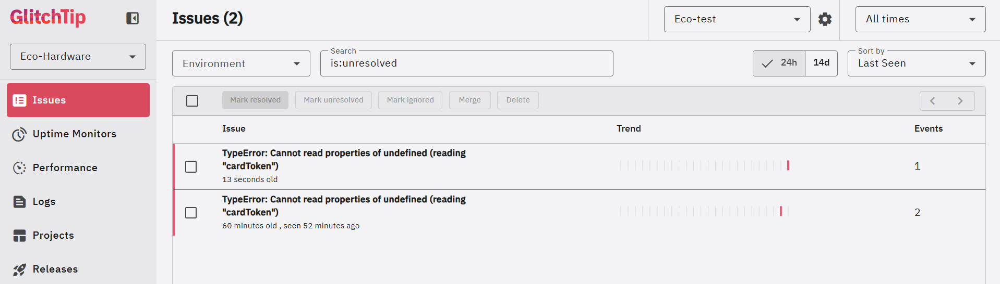
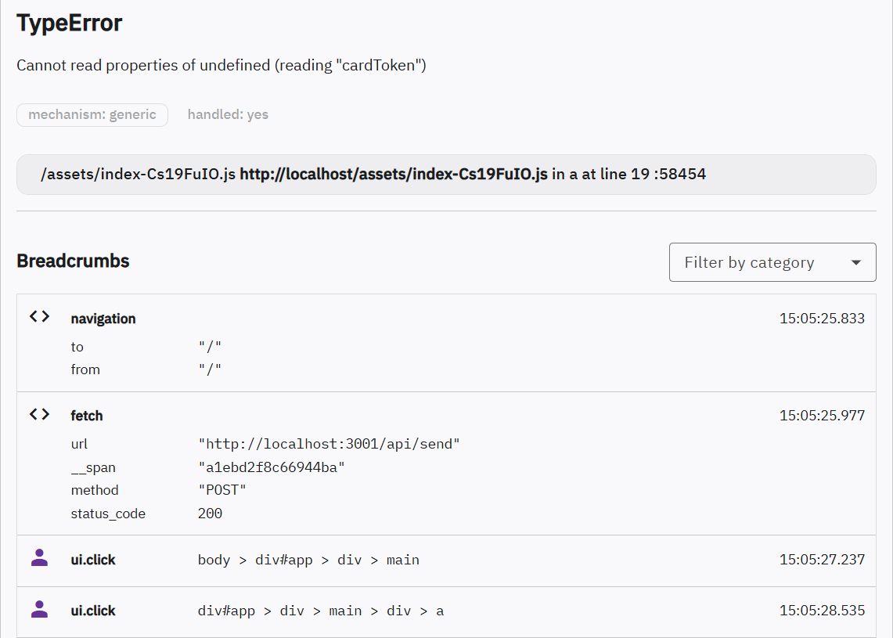

# Rapport d'observabilité - E-Shop Monitor

Ce rapport présente l'analyse des données de télémétrie et d'analytics collectées sur notre plateforme d'e-commerce factice "Eco-Hardware" à l'aide de notre stack auto-hébergée.

## 1. La partie analytics (Umami)

### Tableau de bord général


### Suivi des événements personnalisés


---

### Suivi du tunnel de conversion

Pendant la phase de simulation et de test, nous avons enregistré les interactions suivantes :

| Étape du tunnel      | Événement Umami    | Nombre d'événements |
| :------------------- | :----------------- | :------------------ |
| Consulter un produit | `view_product`     | 31                  |
| Ajouter au panier    | `add_to_cart`      | 68                  |
| Démarrer le paiement | `checkout_start`   | 21                  |
| Paiement validé      | `checkout_success` | 21                  |

### Analyse des métriques métier

1. **Taux de rebond (Bounce Rate)** : 13 %
2. **Taux de conversion** : 262.5 %
    - **Calcul :**
      `Taux = (nombre de checkout_success / nombre de sessions totales) * 100`
      `Calcul : (21 / 8) * 100 = 262.5 %`
    - **Note :** Ce taux anormalement élevé (> 100 %) est dû au fait que nous avons simulé de multiples transactions (21 succès) au cours d'un petit nombre de sessions (8 sessions au total). En conditions réelles, ce taux se situerait plutôt entre 2 % et 5 %.

---

## 2. Analyse technique & Télémétrie des erreurs (GlitchTip)

### Erreur capturée dans l'interface



### Détails d'une trace d'erreur



---

### Diagnostic de l'erreur simulée

- **Type de l'anomalie :** `TypeError`
- **Message de l'erreur :** `Cannot read properties of undefined (reading "cardToken")`

### Procédure pour reproduire l'erreur

Pour reproduire volontairement ce bug dans l'application :

1. Se rendre sur la page d'accueil de l'application (`http://localhost`).
2. Cliquer sur un produit du catalogue pour ouvrir sa fiche détaillée.
3. Cliquer sur le bouton `Ajouter au panier`.<br><br>
4. Se diriger vers le panier via le lien de navigation en haut à droite.
5. Cliquer sur le bouton `Passer la commande`.
6. Cliquer sur le bouton `Payer`.

En raison de la probabilité d'erreur simulée (1 chance sur 3), le paiement peut réussir (redirection vers la confirmation) ou bien échouer. Le cas échéant, réessayez l'opération. Lorsqu'il échoue, le message d'erreur `Paiement échoué. Réessayez.` s'affiche et l'erreur est immédiatement envoyée à GlitchTip.

---

### Résolution technique & Proposition de correction

Grâce aux données remontées par GlitchTip, le développeur dispose de toutes les clés pour corriger rapidement le bug sans avoir à deviner la cause :

1. **La Stack Trace :** Elle isole la ligne exacte de code ayant levé l'exception. Ici, le code tente d'accéder à la propriété `cardToken` sur un objet de transaction qui est indéfini (`undefined`).
2. **Les Fils d'Ariane :** L'historique d'activité de l'utilisateur montre qu'il a cliqué sur le bouton de soumission du formulaire de paiement juste avant le crash.
3. **Le Contexte Environnemental :** Les métadonnées de GlitchTip (OS, version du navigateur, appareil) permettent de valider s'il s'agit d'un bug spécifique à un navigateur (ex: Safari mobile) ou d'un bug général de logique applicative.

#### Proposition de Correction du Code :

Pour corriger définitivement cette erreur dans le code réel, il convient de sécuriser l'accès à l'objet de paiement avant d'en lire les propriétés, soit via un garde conditionnel, soit via le chaînage optionnel (`?.`) :

```javascript
// Exemple de correction dans Checkout.vue (fonction handlePay) :
try {
	// Option 1 : Garde classique de validation
	if (!paymentData || !paymentData.cardToken) {
		throw new Error("Informations de paiement invalides ou manquantes.");
	}

	// Option 2 : Chaînage optionnel sécurisé
	const token = paymentData?.cardToken;
	if (!token) throw new Error("Token de carte manquant.");

	// Logique d'appel API de paiement...
} catch (err) {
	Sentry.captureException(err);
	errorMsg.value = "Le paiement n'a pas pu être traité. Veuillez vérifier vos coordonnées.";
}
```

