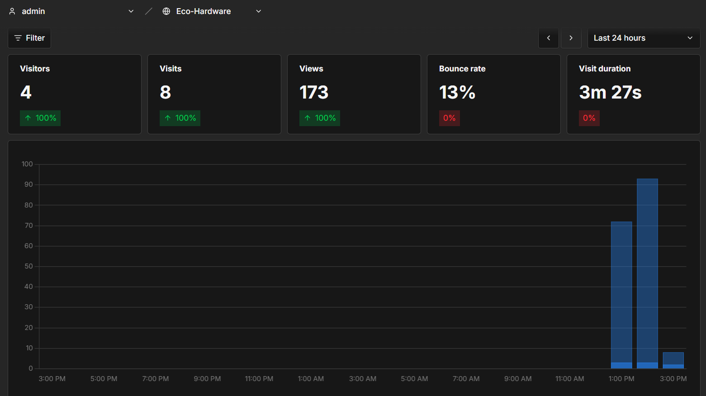
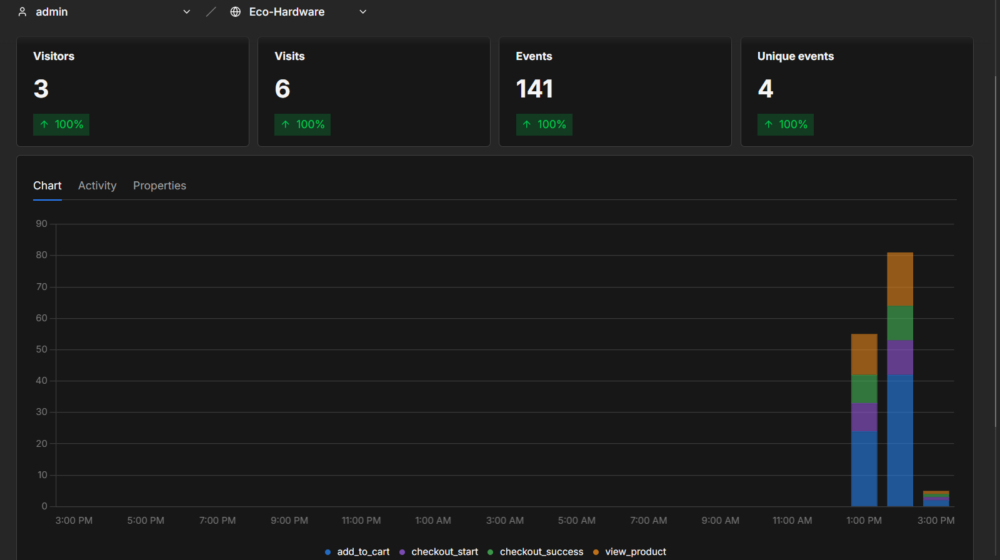
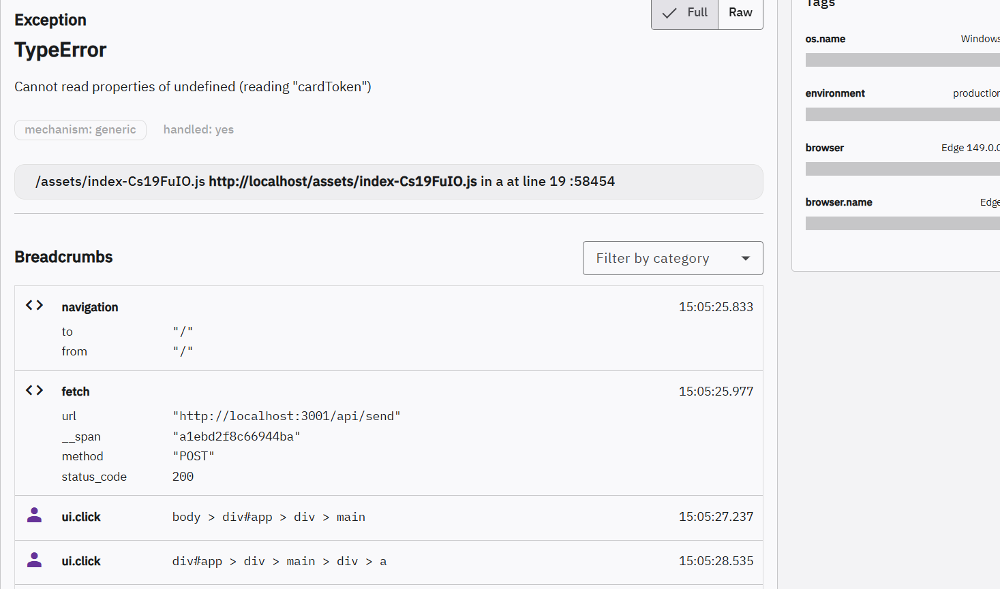

## Umami 

Screenshots de Umami :

Dashboard

Events

Tunnel d'achat :
- 31 consultations de produits (view_product)
- 68 ajouts au panier (add_to_cart)
- 21 débuts de paiement (checkout_start)
- 21 paiements réussis (checkout_success)

Taux de rebond : 13%    

Taux de conversion = checkout_success / visites totales × 100
Taux de conversion : 21 / 8 × 100 = 262%
Le chiffre est élevé car j'ai plusieurs achats sur la meme session pour des tests, en conditions réelles avec plus de trafic ce chiffre serait plus bas et plus représentatif.

## GlitchTip

Screenshots de GlitchTip :

Erreur capturée

Stack trace
 

L'erreur capturée :

Type : TypeError: Cannot read properties of undefined (reading "cardToken")

Comment résoudre à partir de GlitchTip :
Grâce à GlitchTip, le développeur peut voir que l'erreur est un TypeError sur cardToken. 

Les Breadcrumbs montrent que l'utilisateur a cliqué sur le bouton Payer. Le développeur sait donc exactement où chercher dans le code et peut reproduire le bug facilement.

